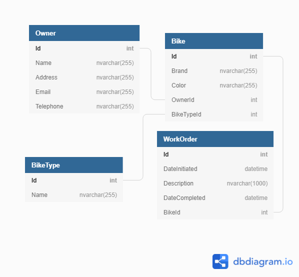

# Bianca's Bike Shop 🚴‍♂️
Our customer Bianca has hired us to build an inventory management system for her bike shop. She wants to keep track of the bike owners she works with, the bikes that they have brought to the shop for repairs, and the maintenance history for each bike. 

## Setup
1. clone this repo
1. open the solution in Visual Studio
1. open the `client` folder in VS Code
1. run the `BiancasBikeShopCreate.sql` script and then `BiancasBikeShopSeed.sql` in the `SQL` folder in SQL Server Object explorer
1. run the project `BiancasBikeShop` in Visual Studio
1. run `npm install` from your terminal in the `client` folder
1. run `npm start` after the installation finishes

## Assignment
You can use any resources to complete these tasks other than copying code from another student's assignment or asking another student for help. Direct any clarifying questions to your instruction team. 
1. Complete the API and client code to display a list of bikes. Look at the client code to determine which data your query will need for the requirements of the front end components.

1. Complete the template code to display a bike's details when the 'Show Details' button is clicked in the bike list. The details should include a bike, its owner, its type, as well as any work orders associated with that bike. 

1. Bianca would like to see how many bikes are currently in the shop to manage her staff's workload. Complete the template code to query for the number of bikes that are currently in the shop. For the purposes of this exercise, a bike is still in the shop if it has at least one open work order associated with it. A work order is considered open if its `DateCompleted` value is `NULL`.
## Some Pointers
1. You do not need to remove or refactor any of the code in this template in order to complete the assignment, only add code in the appropriate places.
1. You should be able to run both the client and api apps when you have finished the setup. If they don't work, ask an instructor for clarification.  
1. Familiarize yourself with the code in the repository before coding your solutions, otherwise you may end up writing code for functionality that has already been implemented. 

## ERD

